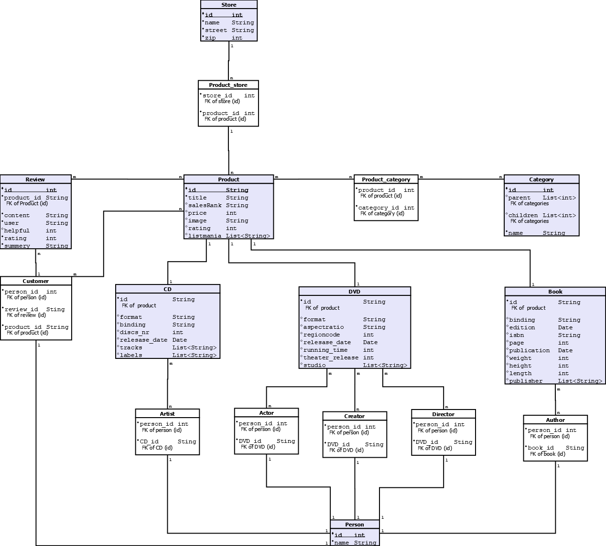

# Store App for DBP

### SS2022

### by:
* #### Abed Alaziz Owidat
* #### Mahmoud Ahmad

### Techs

* Java 17.0.3.1
* Spring 2.6.7
* PostgresSQl -v 14.2.2
* Maven
* JacksonXML
* JAXB XML
* Logback
* SLF4J
* Lombok

### 1. Abgabe
* ### relation schema:

* ### to start loading the data:
  - set up the postgresSQL as it stand in [hier](src/main/resources/application.properties)  
  - run the [script](src/main/resources/schema.sql) to load the schema
  - or just run the Junit function [trySomthing()](src/test/java/com/dpb/store/StoreApplicationTests.java) to load the schema and the data